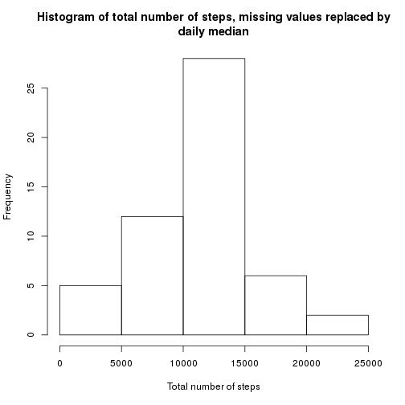

## Loading and preprocessing the data
Let's load the data into a data frame. For the missing value
comparison study let's copy the data to another data frame and remove
any missing values: 

```r
data <- read.csv("activity.csv")
data_without_NA <- na.omit(data)
```


## What is mean total number of steps taken per day?

Let's calculate the mean total number of steps taken per day and plot the histogram of it:

```r
library(dplyr)
summary <- summarize(group_by(data_without_NA, date), mean_steps =
mean(steps), median_steps = median(steps), total_steps = sum(steps))  
hist(summary$total_steps, xlab="Total number of steps", main="Histogram of total number of steps")
```

 

Mean and median of the total number of steps taken per day are 1.0766189 &times; 10<sup>4</sup> and 10765.

## What is the average daily activity pattern?

The daily activity pattern (i.e.) the average number of steps on
interval period averaged on all the days can be achieved as follows:

```r
library(dplyr)
interval_summary <- summarize(group_by(data_without_NA, interval), mean_steps = mean(steps))
with(interval_summary, plot(interval, mean_steps, type="l", xlab="Interval", ylab="Mean number of steps"))
```

 

The maximum number of steps occurs on interval 835.

## Imputing missing values

The number of missing values in the original dataset is 2304. To study the effect of missing values to the original statistics calculated from the dataset, the missing will be replaced with a daily median of the original dataset. This way the original median will not change. Let's do it by executing the following code:


```r
for (index in 1:nrow(summary)) {
    data[is.na(data$steps) & data$date == summary$date[index], 1] <- summary$median_steps[index]
}
```

Now let's plot the histogram again and calculate the values with the filled dataset.


```r
summary <- summarize(group_by(data, date), mean_steps = mean(steps),
median_steps = median(steps), total_steps = sum(steps))
hist(summary$total_steps, xlab="Total number of steps",
main="Histogram of total number of steps, missing values replaced by
daily median")
```

 

There are still 8 days, where all the steps
values are missing. The strategy of filling with median value does not
work in this case because there are no value from where to calculate
the median. Those days have to be dropped from the analysis. For the
rest, the mean and median of the total number of steps taken per day
are 1.0766189 &times; 10<sup>4</sup> and 1.0765 &times; 10<sup>4</sup>. These values are practically
the same as before replacing missing values, which means that missing
values do not play a significant role in mean and median calculation. 


## Are there differences in activity patterns between weekdays and weekends?

Let's first create a factor variable indicating weekday or weekend:


```r
data <- na.omit(data)
data$daytype <- factor('weekday', levels=c('weekday','weekend'))
data[format(as.Date(data$date),"%u") == "6", 4] <- 'weekend'
data[format(as.Date(data$date),"%u") == "7", 4] <- 'weekend'
```

Then let's calculate average number of steps for each interval on weekdays and weekends
and plolt the average number of steps as a function of interval.

```r
interval_summary <- summarize(group_by(data, interval, daytype), mean_steps = mean(steps))
with(interval_summary, xyplot(mean_steps ~ interval | daytype,
type="l", layout=c(1,2),xlab="Interval", ylab="Mean number of steps")) 
```

 

There can be seen differences in the activity patterns.
